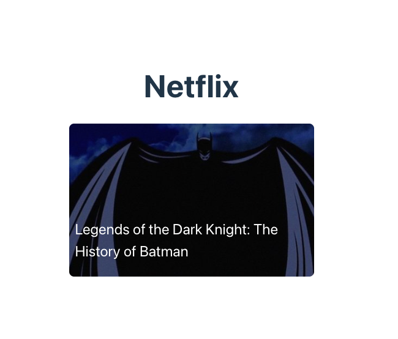

# React + Vite

✅ Step 1: Add a single movie card - 
Key objectives - JSX, component design. 

✅ Step 2: Add multiple movie cards. -
Key objectives - array.map, conditional rendering, css styles
Step 3 - Adding formatting, setting standards., moving to typescript, component structuring, 

Step 4: Add event handling - 
hover effect, handling events. 

Step 4: Fetching api using useEffect 
managing data, handling error states, implementing loading.

Step 5: routing - clicking opens a new page. 
Step - infinite scrolling
Step - react query for better data handling
Step - performanc eoptimization - image optimization, preloading assets, proper format
Step - accessibility
Step - clerk add - auth

Step - adding error monitoring

Productionaizing
Step 6: 